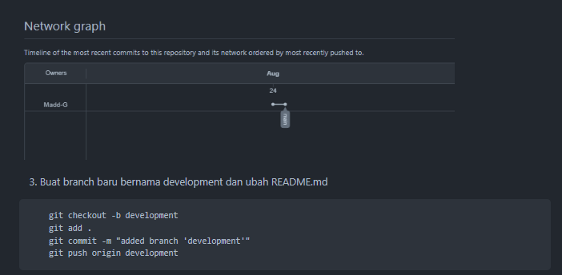
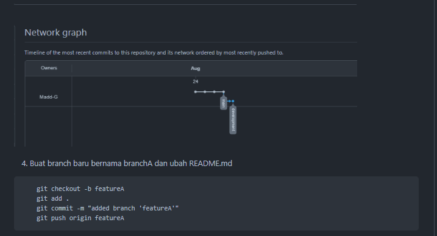
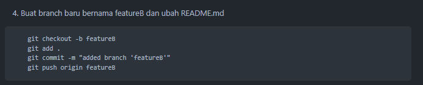

Nama: Akhmad Nur Alamsyah

## Langkah praktikum

1. Buat repositori baru bernama 'learn git'
```
    echo "# learn-git" >> README.md
    git init
    git add README.md
    git commit -m "first commit"
    git branch -M main
    git remote add origin https://github.com/Madd-G/learn-git.git
    git push -u origin main
```


2. Modifikasi README.md pada main
```
    git add .
    git commit -m "modified branch 'main'"
    git push origin main
```


3. Buat branch baru bernama development dan ubah README.md
```
    git checkout -b development
    git add .
    git commit -m "added branch 'development'"
    git push origin development
```



4. Buat branch baru bernama featureA dan ubah README.md
```
    git checkout -b featureA
    git add .
    git commit -m "added branch 'featureA'"
    git push origin featureA
```




6. Merge development dengan featureA dengan cara non fast forward
```
    git merge featureA --no-ff
```


4. Buat branch baru bernama featureB dan ubah README.md
```
    git checkout -b featureB
    git add .
    git commit -m "added branch 'featureB'"
    git push origin featureB
```




7. Merge development dengan featureB dengan cara non fast forward dan terjadi konflik, diselesaikan dengan cara accept both (bisa juga recent atau incoming changes)